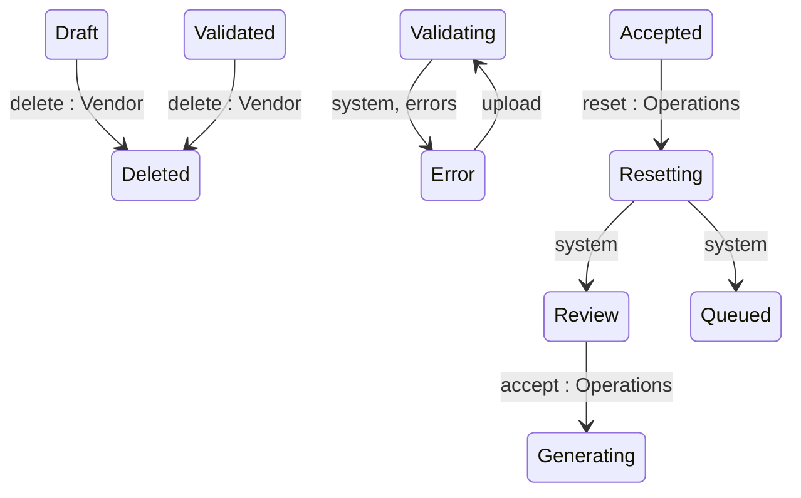

## State diagram

<figure><figcaption>
The state transition diagram of a client account.
</figcaption></figure>

```mermaid
stateDiagram-v2
    Draft --> Deleted : delete : Vendor
    Validating --> Error : system, errors
    Error --> Validating : upload
    Validated --> Deleted : delete : Vendor
    Review --> Generating : accept : Operations
    Accepted --> Resetting : reset : Operations
    Resetting --> Review : system
    Resetting --> Queued : system
```